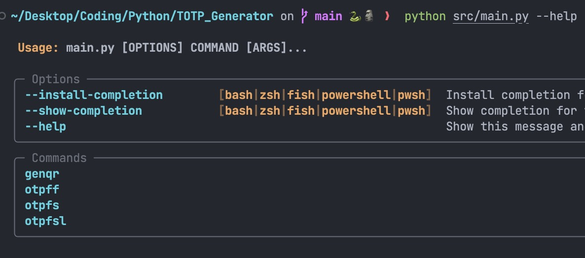
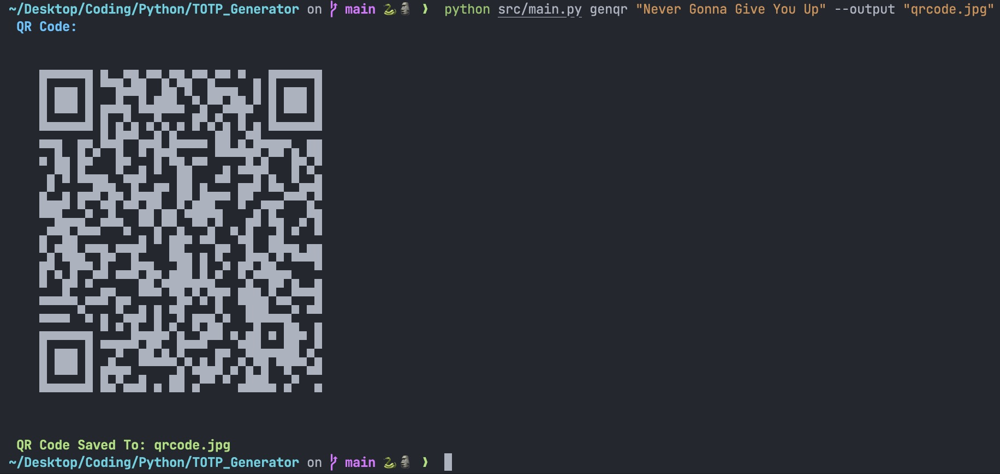
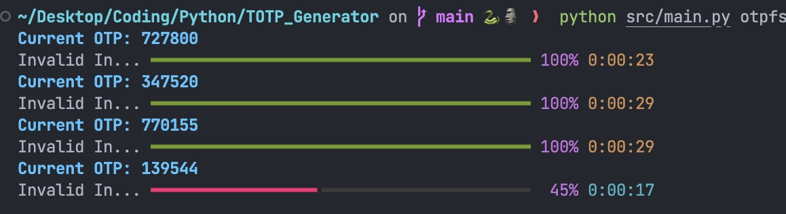

# Time Based One Time Password Generator

This is a quick script I wrote in like an hour because I was wondering how google authenticator works.  

---

### Examples:

This script can generate qrcodes that work with google authenticator (might work with other auth apps but I haven't tested):  
  

This script can also use qrcodes from other applications. I've tested this with my github authenticaton qrcode and also with the one that I generated from the `genqr` command.  

---

## Commands:
- **genqr**: Generates a qrcode from a given secret
- **otpff**: Gets the one time password from a file (image of qrcode)
- **otpfs**: Gets the one time password from provided secret
- **otpfsl**: Gets the one time password from provided secret but stays on a loop showing the latest one every 30 seconds (or whatever the interval is)

If you need help with any of the commands (as some do have optional flags too) use the `--help` flag.

---

This was mainly a test so I probably ain't gonna even use this script again or would recomment using it. Idk if its secure or not.
I was also testing this because I might use something like this in the future when adding 2FA in one of my applications.  